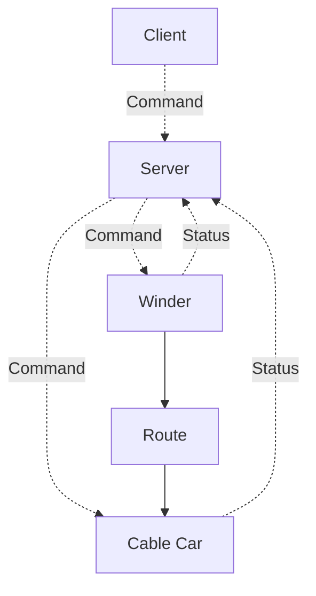

# OPCUA Cable Car Model
A rough model of the San Francisco cable car system. The design very loosely matches how the cable cars operate and has been used as a way of demonstrating what
can be accomplished simulation wise using a mixture of OPCUA and Python asynchronosity.

## Connections

The whole simulation is orchestrated by an server class which creates an OPCUA, any asynchronous processes are assigned to this server class which then runs them.

Commands are sent to the server via a client, these commands change the state of the objects they control (i.e. the winder and the car itself).



## Install & Demonstration

Install the project using [Poetry](https://python-poetry.org), then run the CLI using the command `cablecar` under the created virtual environment:
```sh
$ python -m pip install poetry
$ poetry install
$ poetry run cablecar
INFO:CableCarSim.SimulationServer:Starting server on: opc.tcp://127.0.0.1:4080/freeopcua/server
WARNING:asyncua.server.server:Endpoints other than open requested but private key and certificate are not set.
INFO:CableCarSim.Simulation:Setting up simulation
```

Create a script for a client to send commands to the server:

```python
import asyncua.ua
import asyncua.sync

server_port = 4080
client = asyncua.sync.Client(f"opc.tcp://127.0.0.1:{server_port}/freeopcua/server")

client.connect()

# Fetch the objects node from the server
objects_node = client.get_node(
    asyncua_ua.TwoByteNodeId(asyncua_ua.ObjectIds.ObjectsFolder)
)

# Retrieve the nodes for the winder and car controllers
winder_control = objects_node.get_variables()[1]
car_control = objects_node.get_variables()[-2]

# Turn on the winder for the route
winder_control.set_value("ON")

# Engage the grip control on the car
car_control.set_value("GRIP_ENGAGE")
```

Running the script will attach the cable car to the cable and move it:

```sh
INFO:CableCarSim.Winder.Powell:STATUS=Status.CLOCKWISE
INFO:CableCarSim.Winder.Powell:CONTROLLER=Controller.NONE
INFO:CableCarSim.Winder.Powell:SPEED=4.25
INFO:CableCarSim.CableCar.Car_1:GRIP_STATE=GripState.ENGAGED
INFO:CableCarSim.CableCar.Car_1:CURRENT_SPEED=0.1
INFO:CableCarSim.CableCar.Car_1:CURRENT_POSITION=0.1
INFO:CableCarSim.CableCar.Car_1:CURRENT_LOCATION=('Hyde St & North Point St', 'Hyde St & Beach St')
INFO:CableCarSim.CableCar.Car_1:CURRENT_SPEED=0.2
INFO:CableCarSim.CableCar.Car_1:CURRENT_POSITION=0.30000000000000004
...
INFO:CableCarSim.CableCar.Car_1:Reached route limit, stopping
INFO:CableCarSim.CableCar.Car_1:GRIP_STATE=GripState.RELEASED
```

```mermaid
sequenceDiagram
    participant Client
    participant Server
    participant Powell Winder
    participant Car 1
    Client->>Server: Winder.Powell.CONTROLLER=ON
    Server->>Powell Winder: CONTROLLER=ON
    Note over Powell Winder: STATUS=CLOCKWISE
    Note over Powell Winder: SPEED=4.25
    Powell Winder ->> Server: CONTROLLER=NONE
    Client->>Server: Car.1.CONTROLLER=GRIP_ENGAGE
    Server->>Car 1: CONTROLLER=GRIP_ENGAGE
    Note over Car 1: GRIP_STATE=ENGAGED
    Car 1->>Server: CONTROLLER=NONE
    loop while POSITION < Route Length
        Car 1->>Car 1: POSITION+=SPEED*t
        Car 1->>Car 1: LOCATION=(PREVIOUS, NEXT)
    loop
        Note over Car 1: SPEED < Winder.Powell.SPEED
        Car 1->>Car 1: SPEED+=ACCELERATION*t
    end
    Note over Car 1: SPEED=4.25
    end
    Note over Car 1: SPEED=0.0
    Note over Car 1: POSITION=Route Length
    Note over Car 1: GRIP_STATE=RELEASED
